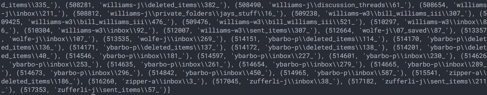
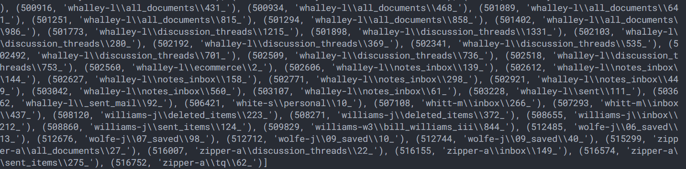
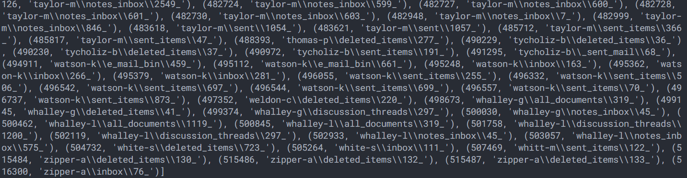
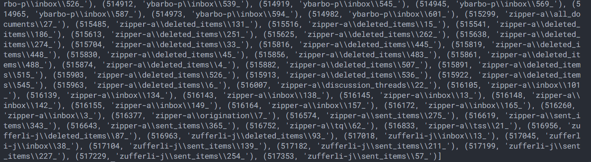
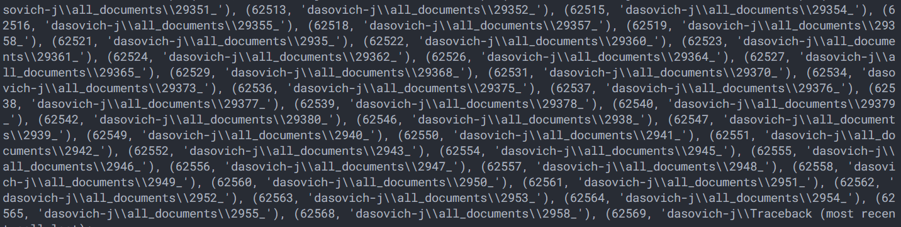
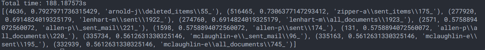
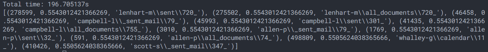

# Lab1

成员：

- 周恩帅 PB17111561

- 张文岚 PB17111587

## 算法概述

首先我们需要对每个文档进行编号，生成一个文档id和路径的映射表`id_path_map.csv`

```python
def gen_id_path_map(dataset_path, id_path_map):
    id_path_dict = {}
    num_files = 0
    for root, dirs, files in os.walk(dataset_path, topdown=False):
        for f in files:
            id_path_dict[num_files] = os.path.join(root.replace(dataset_path, ""), f)
            num_files += 1
    with open(id_path_map, "w+", newline="") as fp:
        w = csv.writer(fp)
        w.writerows(id_path_dict.items())
    return id_path_dict
```

之后每篇文档都以其id来指代。一共是517401篇文档。

### 预处理

数据集是十分庞大的，分词、词干提取等整个跑一遍得花50多分钟，这是难以接受的。所以我们采取分阶段的方式，每执行一步，都将结果保存到文件中。

经过分析，时间瓶颈在分词和词干提取上，因此我们先对文档做了预处理，将每篇文档分词、词干提取、删除停用词的结果保存在`output/doc_tokens`目录下，

这个预处理的过程是漫长的，因此我们考虑使用并行的方式。事实上，这个任务有很好的并行性，将所有文档分成8组，然后拆分到8个核上运行，性能最终有3倍左右的提升：

```python
# 每个核上运行相同的代码
def preprocess(core_id, low_id, high_id, id_path_dict):
    print("Task%d starts..." % core_id)
    for iter in range(low_id, high_id):
        if iter >= util.docs_num:
            break
        if iter % 1000 == 0:
            print(iter)
        doc_id = iter
        doc_path = id_path_dict[doc_id]
        with open(os.path.join("..", "dataset", doc_path)) as doc_fp:
            # 对文档进行分词、词干提取等处理，后面会说到
            doc_str = util.doc2str(doc_fp)
            tokens = util.tokenize(doc_str)
            tokens = map(util.stem, tokens)
            tokens = filter(util.del_stop, tokens)
            path = os.path.join("..", "output", "doc_tokens", "%d.csv" % doc_id)
            write_tokens(path, tokens)
    print("Task%d ends..." % core_id)
```

下面是利用python多进程编写的并行程序：

```python
cores = 8
core_payload = int(util.docs_num / cores) + 1
print("Start preprocessing")
start_time = time.time()
p = Pool(cores)
for i in range(cores):
    p.apply_async(
        preprocess, args=(i, i * core_payload, (i + 1) * core_payload, id_path_dict)
    )
p.close()
p.join()
```

由于我的电脑只有8个核，因此性能还有很大提升空间

### 词条处理

本实验中，我们使用python的nlp工具包对邮件进行了分词、词干提取、删除停用词等处理，其中词干提取算法是Snowball算法，比较快速。

这里的停用词包括数字和特殊符号。

```python
def doc2str(doc_fp):
    try:
        mail = email.parser.Parser().parse(doc_fp)
        mail_subject = mail.get("Subject")
        mail_body = mail.get_payload()
        return mail_subject + " " + mail_body
    except Exception as e:
        return "the"


def tokenize(doc_str):
    doc_str = doc_str.translate(del_tran_table)
    tokens = nltk.tokenize.word_tokenize(doc_str)
    return tokens


def stem(token):
    token = token.lower()
    return stemmer.stem(token)


def del_stop(token):
    return token not in stopwords
```

### 生成Top1000词条

为了减轻内存的压力，本实验只要求对词频前1000的词条进行检索，因此我们先把这前1000的词条找出来，顺便统计这些词条的文档频率：

```python
 # 局部代码
    tokens_ttf = {}
 tokens_df = {}

 for iter in range(util.low_id, util.high_id):
     doc_id = iter
     doc_tokens_path = os.path.join("..", "output", "doc_tokens", "%d.csv" % doc_id)
     with open(doc_tokens_path) as doc_fp:
         r = csv.reader(doc_fp)
         tokens_tf = dict((rows[0], int(rows[1])) for rows in r)
         append_ttf_df(tokens_tf, tokens_ttf, tokens_df)
 ttf_1000 = sorted(tokens_ttf.items(), key=lambda kv: (kv[1], kv[0]), reverse=True)[
     :1000
 ]
 with open(os.path.join("..", "output", "ttf_1000.csv"), "w+", newline="") as fp:
     w = csv.writer(fp)
     w.writerows(ttf_1000)

 tokens_1000 = list(map(lambda x: x[0], ttf_1000))
 df_1000 = list(map(lambda x: (x, tokens_df[x]), tokens_1000))
 with open(os.path.join("..", "output", "df_1000.csv"), "w+", newline="") as fp:
     w = csv.writer(fp)
     w.writerows(df_1000)
```

结果保存在`output/df_1000.csv`和`output/ttf_1000.csv`中，这里ttf指total term frequency，即总词项频率。

### 倒排表

从之前预处理步骤读取每个文档的词条，然后只生成top1000的词条的倒排索引：

```python
with open(os.path.join("..", "output", "ttf_1000.csv")) as fp:
    r = csv.reader(fp)
    total_tf_1000 = list(r)
target_tokens = set(map(lambda x: x[0], total_tf_1000))
inverted_indices = {}
cost_time = [0, 0, 0, 0]
temp_time = [0, 0, 0, 0]
for iter in range(util.low_id, util.high_id):
    doc_id = iter
    doc_tokens_path = os.path.join("..", "output", "doc_tokens", "%d.csv" % doc_id)
    with open(doc_tokens_path) as doc_fp:
        r = csv.reader(doc_fp)
        tokens = set(map(lambda x: x[0], list(r)))
        tokens = filter(token_filter, tokens)
        # add tokens of a certain doc into inverted index table
        append_tokens(tokens, doc_id, inverted_indices)
for key, value in inverted_indices.items():
    path = os.path.join("..", "output", "inverted_index_table", key + ".csv")
    with open(path, "w+", newline="") as fp:
        w = csv.writer(fp)
        for j in value:
            w.writerow([j])
```

结果保存到`output/inverted_index_table/{token}.csv`中，每个词条生成一个倒排索引文件，这样在查找时，就不用把所有的索引都读取进内存，而只需要读取要查询的词条的索引即可，这样速度快且节省内存。

### 布尔检索

为了识别布尔语义，我们需要写一个布尔语句解析器，即使用一种经典的的栈方法来计算bool表达式，参与bool运算的操作数是每个词条对应的索引集合，利用python的set数据结构，可以方便地对结果进行交并补等操作。

```python
def bool_query(origin_query_str):
    query_str = (
        origin_query_str.lower()
        .replace("(", " ( ")
        .replace(")", " ) ")
        .replace("and", "&")
        .replace("or", "|")
        .replace("not", "!")
    )
    query_exp = query_str.split()
    query_exp.append("$")

    operand_stack = list()
    operator_stack = list("$")
    i = 0
    while True:
        element = query_exp[i]
        if element in util.operators_level:
            operator = operator_stack.pop()
            if util.operators_level[operator] < util.operators_level[element]:
                operator_stack.append(operator)
                operator_stack.append(element)
                i += 1
            else:
                if operator == "$":
                    break
                elif operator == "(":
                    if element != ")":
                        operator_stack.append(operator)
                        operator_stack.append(element)
                    i += 1
                elif operator == "!":
                    operand = operand_stack.pop()
                    result = util.operator_func[operator](operand)
                    operand_stack.append(result)
                else:
                    operand1 = operand_stack.pop()
                    operand2 = operand_stack.pop()
                    result = util.operator_func[operator](operand1, operand2)
                    operand_stack.append(result)
        else:
            operand = util.get_indices(element)  # set
            operand_stack.append(operand)
            i += 1
    return operand_stack.pop()
```

### 向量化表示

向量化表示和生成倒排索引类似，对每篇文档中的词项频率进行统计，进而算出每个词项的tf-idf值，从而算出该文档的向量。

每个文档的向量写入`output/doc_wordvec/{doc_id}.csv`中，该任务也可以并行。

```python
def doc_vec(core_id, low_id, high_id):
    print("Task%d starts..." % core_id)
    with open(os.path.join("..", "output", "df_1000.csv")) as fp:
        r = csv.reader(fp)
        target_tokens_df = dict((rows[0], int(rows[1])) for rows in r)
        target_tokens_list = sorted(list(target_tokens_df.keys()))
    for iter in range(low_id, high_id):
        if iter >= util.docs_num:
            break
        if iter % 1000 == 0:
            print(iter)
        doc_id = iter
        doc_tokens_path = os.path.join("..", "output", "doc_tokens", "%d.csv" % doc_id)
        with open(doc_tokens_path) as doc_fp:
            r = csv.reader(doc_fp)
            doc_tokens_tf = dict((rows[0], int(rows[1])) for rows in r)

            w_td = [0] * 1000
            j = 0
            for token in target_tokens_list:
                if token in doc_tokens_tf:
                    w_td[j] = (1 + math.log(doc_tokens_tf[token], 10)) * math.log(
                        util.docs_num / target_tokens_df[token], 10
                    )
                j += 1

            path = os.path.join("..", "output", "doc_wordvec", "%d.csv" % doc_id)
            with open(path, "w+", newline="") as fp:
                w = csv.writer(fp)
                w.writerow(w_td)
    print("Task%d ends..." % core_id)
```

### 语义检索

同样的，对于一个查询语句，我们也对其进行向量化，然后将该向量与每个文档向量求余弦相似度，最终返回前十个文档。

语义检索也可以很好地并行化。将50w+文档拆分到8核上，每个核计算属于它那一组文档和查询的余弦相似度，然后返回十个最相似的文档。

最终，我们从8个核上获得前80个相似文档，然后我们再在这80个文档里挑出前10相似的文档：

```python
query_str = input("Query sentence: ")
query_vec = gen_query_vec(query_str)
print("Start searching")
start_time = time.time()
results = []
p = Pool(cores)
for i in range(cores):
    results.append(
        p.apply_async(
            query, args=(i, query_vec, i * core_payload, (i + 1) * core_payload)
        )
    )
p.close()
p.join()
docs_cos_top_80 = []
for res in results:
    docs_cos_top_80.extend(res.get())
docs_cos = get_top(dict(docs_cos_top_80), 10)
query_results = list(map(lambda x: (x[0], x[1], id_path_dict[x[0]]), docs_cos))
```

## 运行结果

5个查询词：market，energy，business，office，plans

由于结果比较多，截图只保留部分，但是速度还是非常快的，只是前期建立索引比较耗时。

### 布尔检索

输出格式为(文档id，文档路径)

+ `market and energy and business and office and plans`

  

+ `market and not energy and business and office and plans`

  

+ `market and  not (energy or business) and office and plans`

  

+ `market and (energy or business) and (office or plans)`

  

  这个的结果非常之多

+ `not (market or energy or business or office or plans)`

  

  结果太多了，以至于短时间没跑完，被我kill掉了

### 语义检索

语义检索跑起来还是十分耗时的，因为它需要和50w+的文档求余弦相似度，计算和IO都是比较耗时的，因此这里只放两个运行结果示例。

输出格式（文档id，余弦相似度，文档路径）

+ Query sentence: `enron wants to build an office`

  

+ Query sentence: `the president signed projects`

  